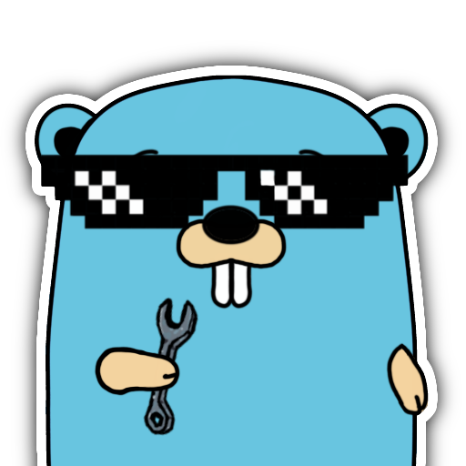

[](https://github.com/t1ltxz-gxd/goSandbox)


# goSandbox
[](https://github.com/t1ltxz-gxd/goSandbox/stargazers')
[](https://github.com/t1ltxz-gxd/goSandbox/issues)
[](https://github.com/DenverCoder1/custom-icon-badges/blob/main/LICENSE?rgh-link-date=2023-03-15T18%3A10%3A26Z "license MIT")
[](https://go.dev/ "Powered by GO")
Sandbox written in Go
___

## 🧩 Installation
```
git clone https://github.com/t1ltxz-gxd/goSandbox 
cd goSandbox
go build
```

## 🚀 Launch
Run `go run cmd/app/main.go` or `make run`.

## 🧹 Linters
Run `golangci-lint run ./... --config=./.golangci.yml` or `make lint`.


## 🤝 Contributing

Contributions are what make the open source community an amazing place to learn, be inspired, and create.
Any contributions you make are **greatly appreciated**.

1. [Fork the repository](https://github.com/t1ltxz-gxd/goSandbox/fork)
2. Clone your fork `git clone https://github.com/t1ltxz-gxd/goSandbox.git`
3. Create your feature branch `git checkout -b AmazingFeature`
4. Stage changes `git add .`
5. Commit your changes `git commit -m 'Added some AmazingFeature'`
6. Push to the branch `git push origin AmazingFeature`
7. Submit a pull request

## ❤️ Credits

Released with ❤️ by [Tilt](https://github.com/t1ltxz-gxd).
